# [📈 Status ao Vivo](https://ggamesbrasil.github.io/pixelproject): <!--status ao vivo--> **🟩 Todos os sistemas operacionais**

This repository contains the open-source uptime monitor and status page for [ggamesbrasil](https://ggamesbrasil.github.io/pixelproject), powered by [Upptime](https://github.com/upptime/upptime).

With [Upptime](https://upptime.js.org), you can get your own unlimited and free uptime monitor and status page, powered entirely by a GitHub repository. We use [Issues](https://github.com/ggamesbrasil/pixelproject/issues) as incident reports, [Actions](https://github.com/ggamesbrasil/pixelproject/actions) as uptime monitors, and [Pages](https://ggamesbrasil.github.io/pixelproject) for the status page.

## [📈 Live Status](https://demo.upptime.js.org): <!--live status--> **🟧 Interrupção parcial**

<!--start: status pages-->
<!-- This summary is generated by Upptime (https://github.com/upptime/upptime) -->
<!-- Do not edit this manually, your changes will be overwritten -->
<!-- prettier-ignore -->
| URL | Status | History | Tempo de resposta | Tempo de atividade total |
| --- | ------ | ------- | ------------- | ------ |
|  [Acronsoft](https://acronsoft.com.br/) | Operacional | [acronsoft.yml](https://github.com/ggamesbrasil/pixelproject/commits/HEAD/history/acronsoft.yml) | 

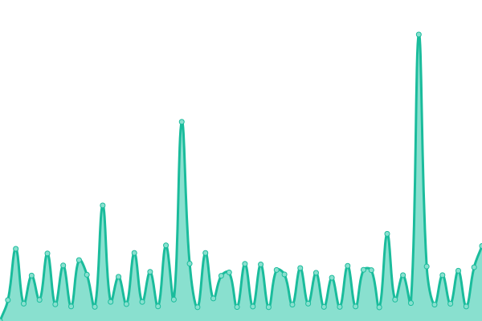 1721ms
     
 | 

<a href="https://ggamesbrasil.github.io/pixelproject/history/acronsoft">85.44%</a>
    

|  [Autos24h](https://autos24h.com.br/) | Operacional | [autos24h.yml](https://github.com/ggamesbrasil/pixelproject/commits/HEAD/history/autos24h.yml) | 

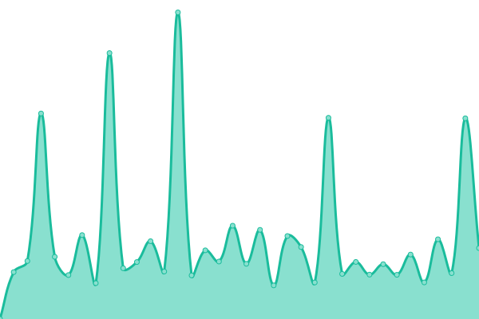 1368ms
     
 | 

<a href="https://ggamesbrasil.github.io/pixelproject/history/autos24h">94.49%</a>
    

|  [COB EXPO](https://cobexpo.com.br/) | Operacional | [cob-expo.yml](https://github.com/ggamesbrasil/pixelproject/commits/HEAD/history/cob-expo.yml) | 

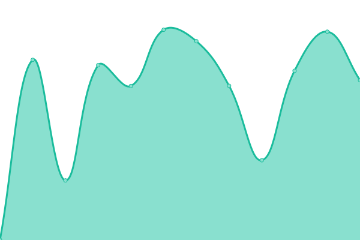 1788ms
     
 | 

<a href="https://ggamesbrasil.github.io/pixelproject/history/cob-expo">94.49%</a>
    

|  [Despacho Rápido](https://despachorapido.com.br/) | Operacional | [despacho-rapido.yml](https://github.com/ggamesbrasil/pixelproject/commits/HEAD/history/despacho-rapido.yml) | 

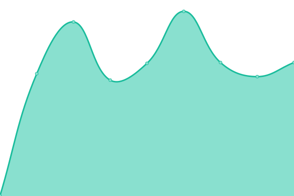 888ms
     
 | 

<a href="https://ggamesbrasil.github.io/pixelproject/history/despacho-rapido">100.00%</a>
    

|  [Farma Piedade](https://farmapiedade.com.br/) | Operacional | [farma-piedade.yml](https://github.com/ggamesbrasil/pixelproject/commits/HEAD/history/farma-piedade.yml) | 

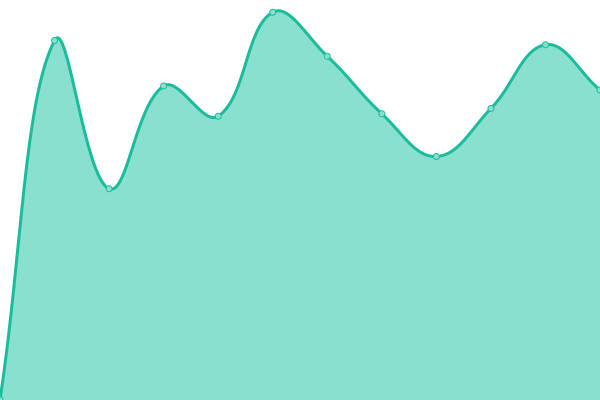 1165ms
     
 | 

<a href="https://ggamesbrasil.github.io/pixelproject/history/farma-piedade">90.87%</a>
    

|  [Flávia Carvalho Pinto](https://flaviacarvalhopinto.com.br/) | Operacional | [flavia-carvalho-pinto.yml](https://github.com/ggamesbrasil/pixelproject/commits/HEAD/history/flavia-carvalho-pinto.yml) | 

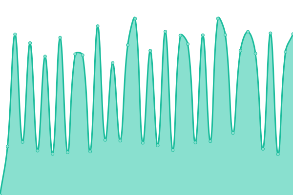 2047ms
     
 | 

<a href="https://ggamesbrasil.github.io/pixelproject/history/flavia-carvalho-pinto">82.28%</a>
    

|  [Geek](https://geek.etc.br/) | Operacional | [geek.yml](https://github.com/ggamesbrasil/pixelproject/commits/HEAD/history/geek.yml) | 

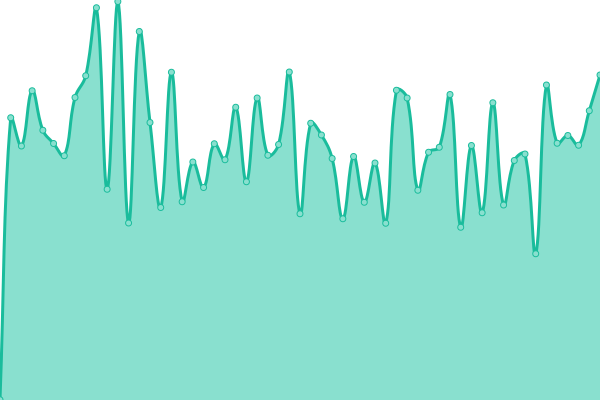 1081ms
     
 | 

<a href="https://ggamesbrasil.github.io/pixelproject/history/geek">77.41%</a>
    

|  [GGames](https://ggames.com.br/) | Operacional | [g-games.yml](https://github.com/ggamesbrasil/pixelproject/commits/HEAD/history/g-games.yml) | 

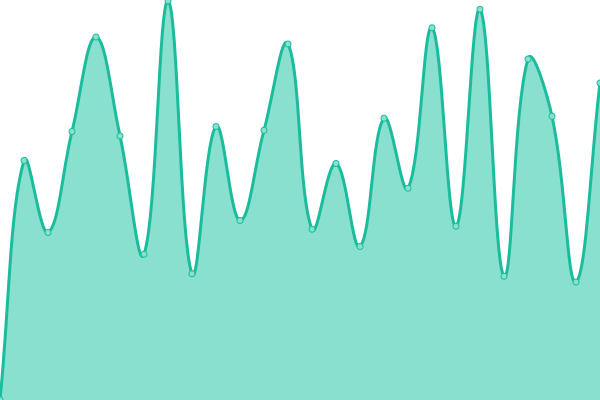 990ms
     
 | 

<a href="https://ggamesbrasil.github.io/pixelproject/history/g-games">73.59%</a>
    

|  [GGames T](https://t.ggames.com.br/) | Operacional | [g-games-t.yml](https://github.com/ggamesbrasil/pixelproject/commits/HEAD/history/g-games-t.yml) | 

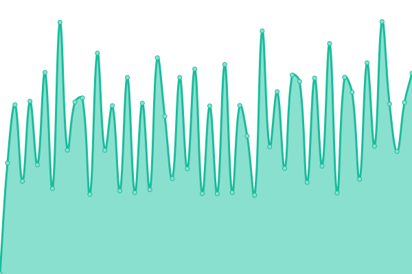 1030ms
     
 | 

<a href="https://ggamesbrasil.github.io/pixelproject/history/g-games-t">90.15%</a>
    

|  [GGBr](https://ggbr.me/) | Operacional | [gg-br.yml](https://github.com/ggamesbrasil/pixelproject/commits/HEAD/history/gg-br.yml) | 

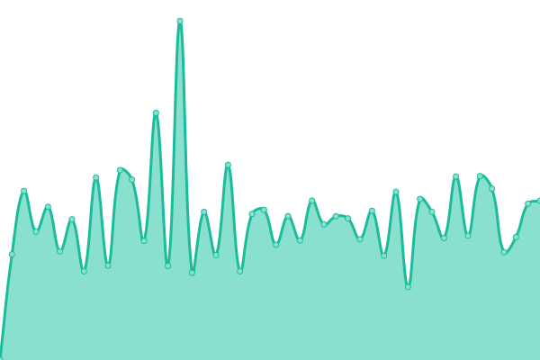 969ms
     
 | 

<a href="https://ggamesbrasil.github.io/pixelproject/history/gg-br">90.15%</a>
    

|  [Grazing Table](https://grazingtable.com.br/) | Operacional | [grazing-table.yml](https://github.com/ggamesbrasil/pixelproject/commits/HEAD/history/grazing-table.yml) | 

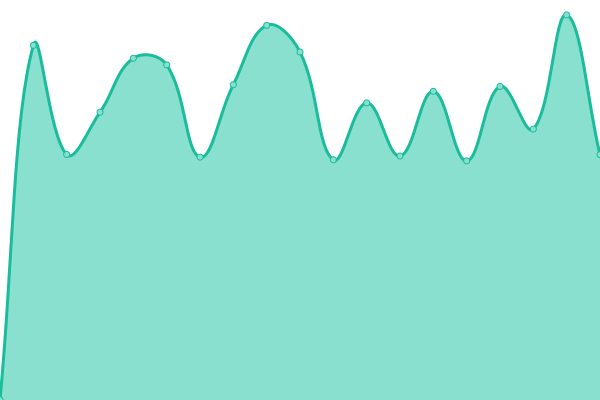 1261ms
     
 | 

<a href="https://ggamesbrasil.github.io/pixelproject/history/grazing-table">91.27%</a>
    

|  [HigiQualy](https://higiqualy.com.br/) | Operacional | [higi-qualy.yml](https://github.com/ggamesbrasil/pixelproject/commits/HEAD/history/higi-qualy.yml) | 

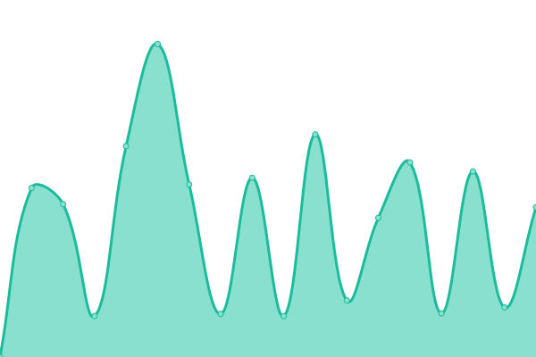 2464ms
     
 | 

<a href="https://ggamesbrasil.github.io/pixelproject/history/higi-qualy">88.16%</a>
    

|  [La Plus Consultoria](https://laplusconsultoria.com.br/) | Operacional | [la-plus-consultoria.yml](https://github.com/ggamesbrasil/pixelproject/commits/HEAD/history/la-plus-consultoria.yml) | 

 5857ms
     
 | 

<a href="https://ggamesbrasil.github.io/pixelproject/history/la-plus-consultoria">100.00%</a>
    

|  [Blog Marcos Lopes](https://blogmarcoslopes.com/) | Operacional | [blog-marcos-lopes.yml](https://github.com/ggamesbrasil/pixelproject/commits/HEAD/history/blog-marcos-lopes.yml) | 

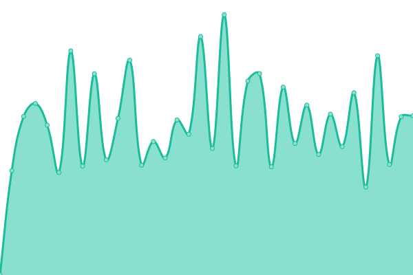 965ms
     
 | 

<a href="https://ggamesbrasil.github.io/pixelproject/history/blog-marcos-lopes">95.26%</a>
    

|  [Mercado](http://mercado.etc.br/) | Operacional | [mercado.yml](https://github.com/ggamesbrasil/pixelproject/commits/HEAD/history/mercado.yml) | 

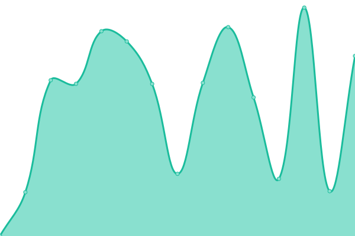 1016ms
     
 | 

<a href="https://ggamesbrasil.github.io/pixelproject/history/mercado">76.00%</a>
    

|  [Otimização SEO](https://otimizacaoseo.com.br/) | Operacional | [otimizacao-seo.yml](https://github.com/ggamesbrasil/pixelproject/commits/HEAD/history/otimizacao-seo.yml) | 

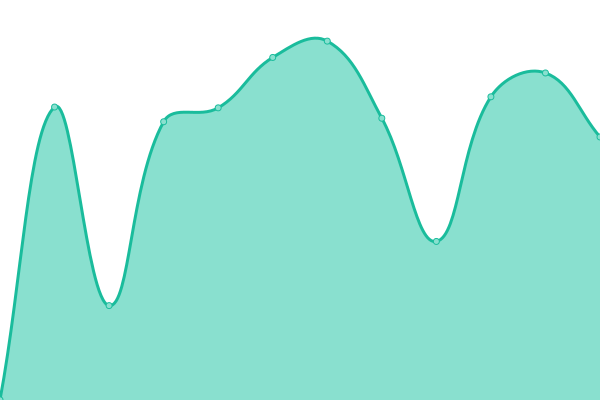 1564ms
     
 | 

<a href="https://ggamesbrasil.github.io/pixelproject/history/otimizacao-seo">90.16%</a>
    

|  [Pixeel](https://pixeel.net) | Inativo | [pixeel.yml](https://github.com/ggamesbrasil/pixelproject/commits/HEAD/history/pixeel.yml) | 

 678ms
     
 | 

<a href="https://ggamesbrasil.github.io/pixelproject/history/pixeel">0.00%</a>
    

|  [Pixel Project](https://pixelproject.com.br/) | Operacional | [pixel-project.yml](https://github.com/ggamesbrasil/pixelproject/commits/HEAD/history/pixel-project.yml) | 

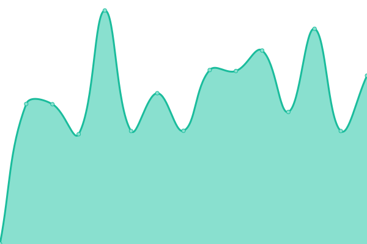 680ms
     
 | 

<a href="https://ggamesbrasil.github.io/pixelproject/history/pixel-project">94.49%</a>
    

|  [Ponta Negra News](https://pontanegranews.com.br/) | Operacional | [ponta-negra-news.yml](https://github.com/ggamesbrasil/pixelproject/commits/HEAD/history/ponta-negra-news.yml) | 

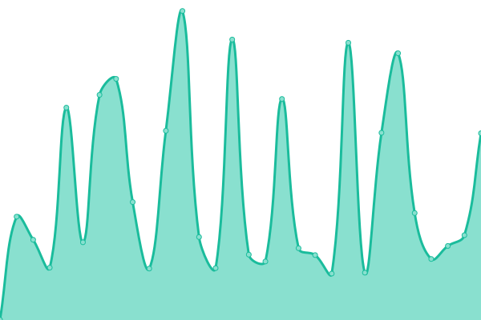 611ms
     
 | 

<a href="https://ggamesbrasil.github.io/pixelproject/history/ponta-negra-news">88.64%</a>
    

|  [Thunder Cheats](https://thundercheats.com.br/) | Operacional | [thunder-cheats.yml](https://github.com/ggamesbrasil/pixelproject/commits/HEAD/history/thunder-cheats.yml) | 

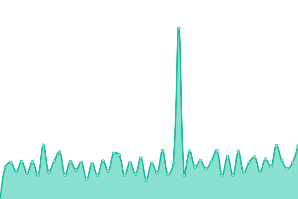 1089ms
     
 | 

<a href="https://ggamesbrasil.github.io/pixelproject/history/thunder-cheats">94.48%</a>
    

|  [Todeschini Sorocaba](https://todeschinisorocaba.com.br/) | Operacional | [todeschini-sorocaba.yml](https://github.com/ggamesbrasil/pixelproject/commits/HEAD/history/todeschini-sorocaba.yml) | 

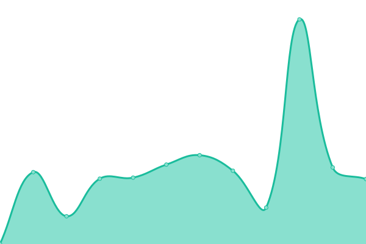 927ms
     
 | 

<a href="https://ggamesbrasil.github.io/pixelproject/history/todeschini-sorocaba">87.86%</a>
    

|  [Valor do Site](https://valordosite.com.br/) | Operacional | [valor-do-site.yml](https://github.com/ggamesbrasil/pixelproject/commits/HEAD/history/valor-do-site.yml) | 

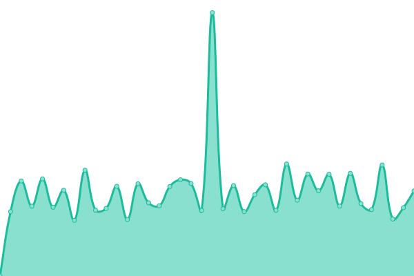 931ms
     
 | 

<a href="https://ggamesbrasil.github.io/pixelproject/history/valor-do-site">78.32%</a>
    

|  [Vários Link](https://varios.link/) | Operacional | [varios-link.yml](https://github.com/ggamesbrasil/pixelproject/commits/HEAD/history/varios-link.yml) | 

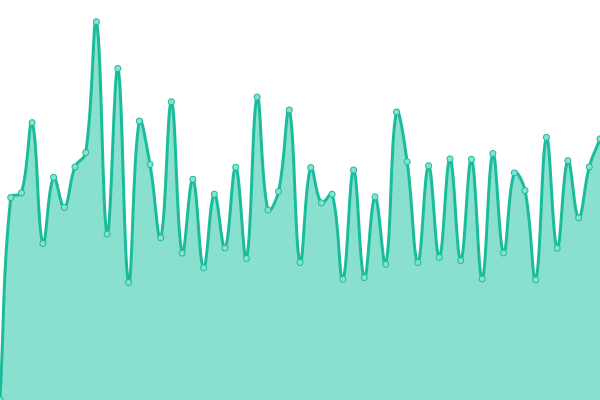 990ms
     
 | 

<a href="https://ggamesbrasil.github.io/pixelproject/history/varios-link">93.43%</a>
    

|  [Vila Rica](https://vilaricacapital.com.br/) | Operacional | [vila-rica.yml](https://github.com/ggamesbrasil/pixelproject/commits/HEAD/history/vila-rica.yml) | 

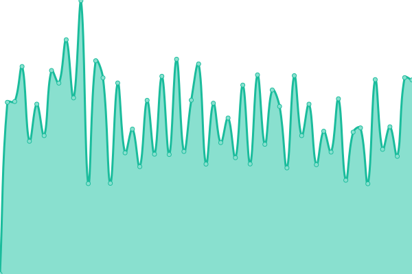 1049ms
     
 | 

<a href="https://ggamesbrasil.github.io/pixelproject/history/vila-rica">94.48%</a>
    

|  [Whats Fácil](https://whatsfacil.com/) | Operacional | [whats-facil.yml](https://github.com/ggamesbrasil/pixelproject/commits/HEAD/history/whats-facil.yml) | 

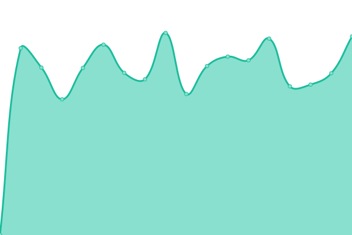 853ms
     
 | 

<a href="https://ggamesbrasil.github.io/pixelproject/history/whats-facil">94.48%</a>
    

<!--end: status pages-->

[**Visit our status website →**](https://ggamesbrasil.github.io/pixelproject)

## 📄 License

- Powered by: [Upptime](https://github.com/upptime/upptime)
- Code: [MIT](./LICENSE) © [Anand Chowdhary](https://anandchowdhary.com), supported by [Pabio](https://pabio.com)
- Data in the `./history` directory: [Open Database License](https://opendatacommons.org/licenses/odbl/1-0/)
